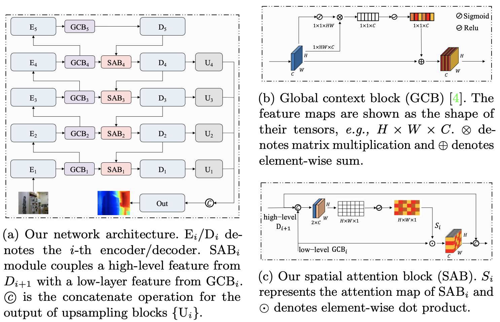
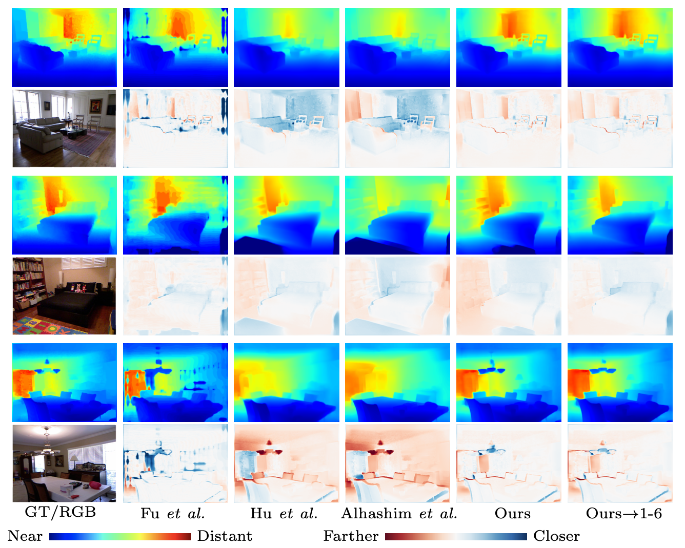

## Improving Monocular Depth Estimation by Leveraging Structural Awareness and Complementary Datasets

This repository contains code to compute depth from a single image. It accompanies our [paper](https://arxiv.org/pdf/2007.11256.pdf):

>Improving Monocular Depth Estimation by Leveraging Structural Awareness and Complementary Datasets  
Tian Chen⋆, Shijie An⋆, Yuan Zhang, Chongyang Ma, Huayan Wang, Xiaoyan Guo, and Wen Zheng


### Setup 

1) Download the model weights [SANet-NYUv2.pth](https://pan.baidu.com/s/1bh0TyXuZoesiTxuxzMn5iA)(password:x55o) and place the
file in the pretrained folder.

2) Set up dependencies: 

    ```shell
    conda install pytorch torchvision opencv
    ```

   The code was tested with Python 3.6, PyTorch 1.1.0, and OpenCV 4.1.2.

    
### Usage

1) Place the pretrained model in the folder `pretrained`.

2) Run the model:

    ```shell
    python test.py --cuda
    ```

### Results

(1) Our network architecture



(2) Our result compare on NYUv2 dataset




### Citation

Please cite our paper if you use this code or any of the models:
```
@article{Tian2020,
	author    = {Tian Chen⋆, Shijie An⋆, Yuan Zhang, Chongyang Ma, Huayan Wang, Xiaoyan Guo, and Wen Zheng},
	title     = {Improving Monocular Depth Estimation by Leveraging Structural Awareness and Complementary Datasets},
	journal   = {},
	year      = {2020},
}
```


### License 

MIT License 
